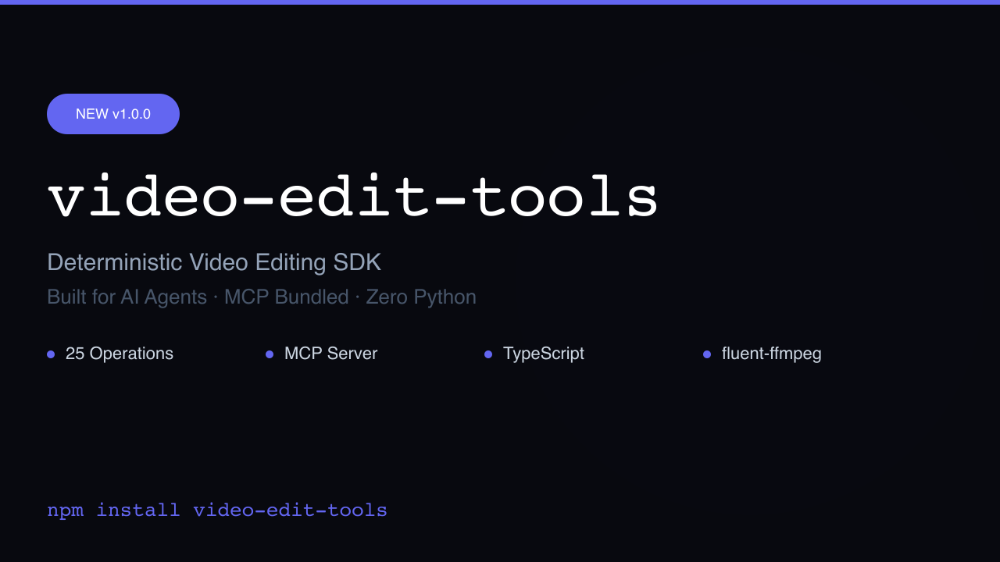

# video-edit-tools

Deterministic video editing SDK for AI agents. Ships with MCP tools.

## Demo

[](./examples/intro-video/output/intro-en.mp4)

## Features

- **Never Throws**: All functions return `Promise<Result<T>>`.
- **Deterministic**: Same input + same options = same output.
- **Pure Functions**: No side effects, no global state.
- **TypeScript First**: Strict types, comprehensive JSDoc.
- **Zero Python**: Uses `@ffmpeg-installer/ffmpeg` and `@xenova/transformers`. No system dependencies needed.

## Installation

```bash
npm install video-edit-tools
```

## Quick Start

```typescript
import { pipeline, getMetadata } from 'video-edit-tools';

const result = await pipeline('input.mp4', [
  { op: 'trim', start: 0, end: 10 },
  { op: 'resize', width: 1280, height: 720, fit: 'cover' },
  { op: 'addText', layers: [{ text: 'Hello', x: 100, y: 100, fontSize: 48, color: '#FFFFFF' }] }
]);

if (result.ok) {
  const meta = await getMetadata(result.data);
  console.log(meta);
  // Do something with result.data (Buffer)
} else {
  console.error(result.error);
}
```

## MCP Server Setup

Add this configuration to your Claude Desktop or Cursor MCP settings to enable the agent tools:

```json
{
  "mcpServers": {
    "video-edit-tools": {
      "command": "node",
      "args": ["/absolute/path/to/node_modules/video-edit-tools/dist/mcp/index.js"]
    }
  }
}
```

Or using `npx` if installed globally/locally:

```json
{
  "mcpServers": {
    "video-edit-tools": {
      "command": "npx",
      "args": ["video-edit-tools-mcp"]
    }
  }
}
```

## Available Operations

- `trim`, `concat`, `resize`, `crop`, `changeSpeed`, `convert`, `extractFrames`
- `addText`, `addSubtitles`, `composite`, `gradientOverlay`, `blurRegion`, `addTransition`
- `extractAudio`, `replaceAudio`, `adjustVolume`, `muteSection`, `transcribe` (Whisper)
- `adjust`, `applyFilter`, `detectScenes`, `generateThumbnail`
- `pipeline` (sequential), `batch` (parallel pipelines)

## Architecture

This package wrappers `fluent-ffmpeg` and `@ffmpeg-installer/ffmpeg` to safely run operations locally without needing system paths. Temporary files are safely managed in the OS temp directory and cleaned up via `process.on('exit')` hooks.
